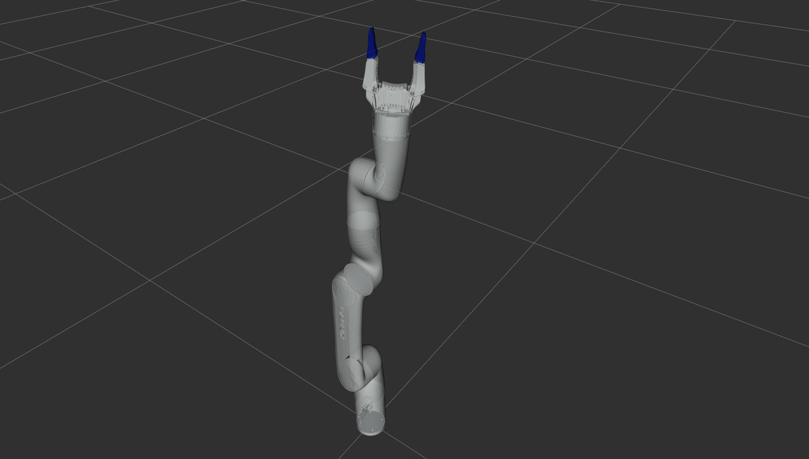

# kinova_robot_arm #

Automatic Addison ROS 2 support for the Gen3 Lite Robotic arm by Kinova Robotics.



## Overview

This package provides ROS 2 support for the Kinova Gen3 Lite robotic arm. It includes URDF/Xacro descriptions.

## Contents

- `kinova_robot_arm_description`: Contains URDF/Xacro files for the Gen3 Lite arm
  - `urdf/gen3_lite_gen3_lite_2f.xacro`: Main Xacro file describing the complete arm with gripper

## Features

- 6 degrees of freedom (DOF) arm configuration
- Integrated two-finger gripper (Gen3 Lite 2F)
- Configurable joint limits and physical parameters

## Usage

To view this robot in RViz:

1. Clone this repository into your ROS 2 workspace
2. Build your workspace (i.e. colcon build)
3. Install the urdf_tutorial package for your ROS distribution:

```bash
sudo apt install ros-${ROS_DISTRO}-urdf-tutorial
```

4. To launch the URDF model viewer, use the following command:

```bash
ros2 launch urdf_tutorial display.launch.py model:=/home/ubuntu/ros2_ws/src/kinova_robot_arm/kinova_robot_arm_description/urdf/gen3_lite_gen3_lite_2f.xacro
```
This command will launch the URDF viewer with the specified Kinova Gen3 Lite robot arm model. 

5. Remember to set the Fixed Frame under "Global Options" in RViz to the 'world' frame.

## Dependencies

- ROS 2 (tested on ROS 2 Iron)

## License

This project is licensed under the BSD 3-Clause License. See the LICENSE file for details.

## Acknowledgements

This package is based on the work by Kinova Robotics and has been adapted for ROS 2 use.

